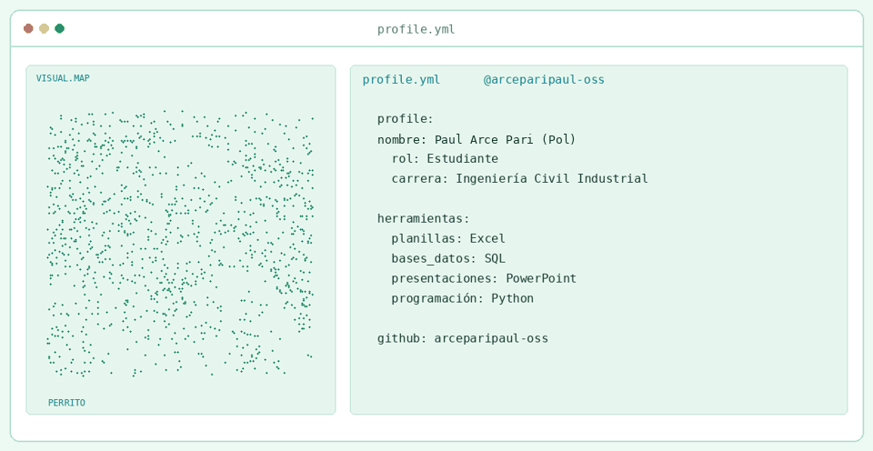
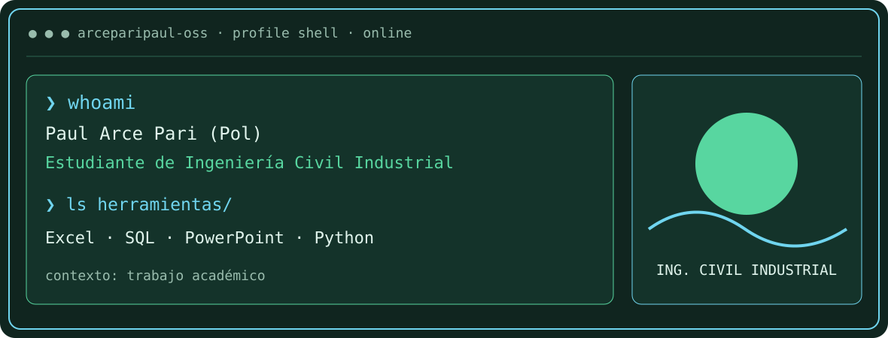
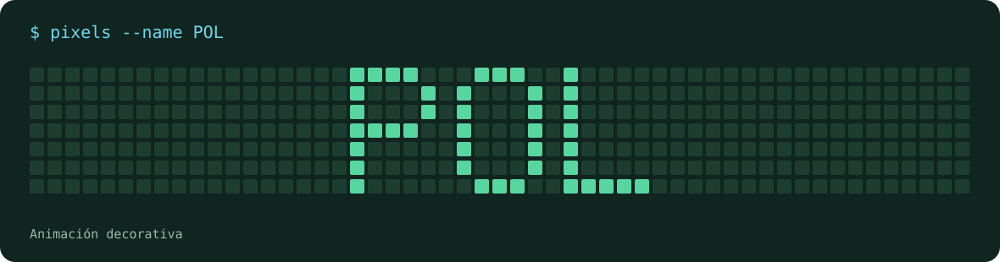

### Paul Arce Pari (Pol)
**Estudiante de Ingeniería Civil Industrial**

---

## `$ whoami`

## `$ cat herramientas.yaml`

| Herramienta | Uso |
| --- | --- |
| **Excel** | Hojas de cálculo |
| **SQL** | Consultas a bases de datos |
| **PowerPoint** | Presentaciones |
| **Python** | Programación |

---

## `$ pixels --animate`

--- | --- |
| **Excel** | Hojas de cálculo |
| **SQL** | Consultas a bases de datos |
| **PowerPoint** | Presentaciones |
| **Python** | Programación |

---

## `$ connect --github`

Diseño adaptado de <a href="https://github.com/macu-dev/macu-dev">macu-dev</a> · Personalizado en verde y celeste.

